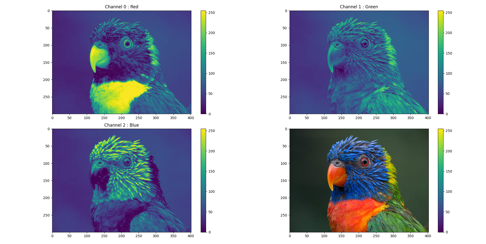
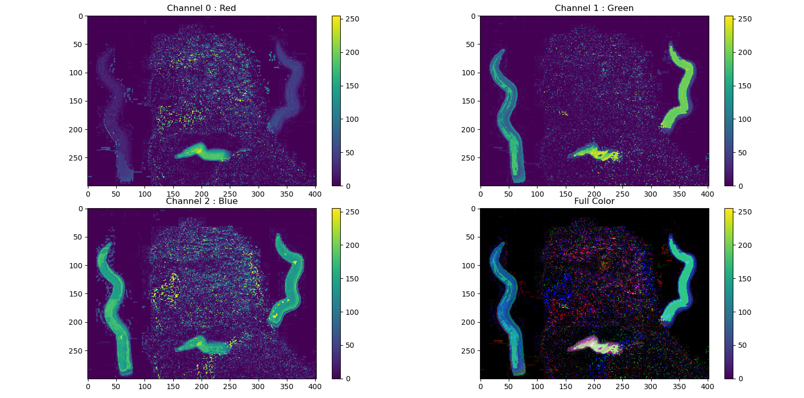

# Diff-Heat
Visualizing differences between two RGB images.

The script is tested with JPG and PNG format, but it should work with any image type supported by matplotlib.

## Usage

To show a picture :
```
./diff-heat.py parrot.jpg
```


To show the differences between two pictures :
```
./diff-heat.py parrot.jpg parrot_paint.jpg
```


## TODO
- couleurs inversées quand affiche 1 image jpg
- pas d'affichage en full color quand diff 2 images png
