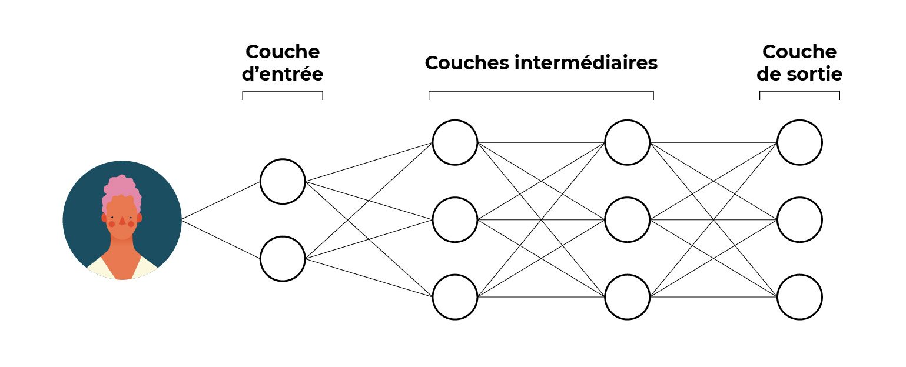
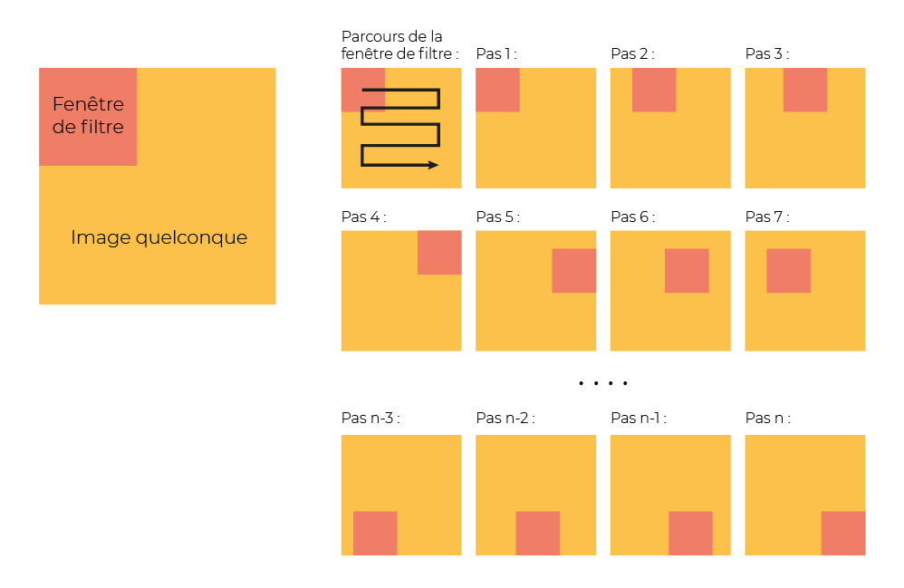

https://openclassrooms.com/fr/courses/6417031-objectif-ia-initiez-vous-a-lintelligence-artificielle

# Initiation à l'intelligence artificielle

[toc]

## Etapes d'un projet

### Récupérez des données

Les données sont comme le carburant d’un projet de Data Science. Sans données, impossible d’assurer le succès de notre projet !

À ce stade, vous chercherez à collecter le plus de données possibles, même si vous n’êtes pas sûr de les utiliser par la suite pour mieux comprendre la consommation d’énergie de l’usine.

Vous pourrez enfin récolter des données plus générales, comme par exemple la météo locale pour chaque jour. Vous pourrez vous intéresser à des données telles que l’ensoleillement, les précipitations, le vent, les températures, etc. Ces données peuvent sûrement impacter votre consommation d’énergie. Votre équipe aura l’occasion de le vérifier par la suite.

### Nettoyez vos données

Vous et votre équipe avez collecté de nombreuses données. Avant de pouvoir les exploiter, vous devez vous assurer que ces données sont bien fiables.

Voici deux exemples typiques de contrôle :

- **regarder s’il y a des données manquantes.** En effet, il est très probable que vos données ne soient pas exhaustives.

> Par exemple, à la suite d’une panne informatique, certains capteurs ont été défaillants dans l’enregistrement des données de consommation.

- **vous assurer qu’il n’y a pas de données aberrantes.**

> Par exemple, en observant les données de température, on observe pour une journée des températures très élevées qui ne peuvent pas être celles réellement observées. Il peut s’agir d’une anomalie informatique ponctuelle.

Dans ces deux cas, les données concernées ne sont pas satisfaisantes. Le Data Scientist de votre équipe peut par exemple choisir de remplacer les données manquantes ou erronées au moyen d’outils statistiques. On parle ici d’**imputation statistique**.

### Explorez vos données

L’idée est de comprendre le phénomène de consommation d’énergie. Les données vous aideront à répondre à des questions telles que :

- quelle est la consommation moyenne par jour, par semaine, par mois ?
- quand est-ce que nous consommons le plus d’énergie ?

L’exploration des données permet aussi de vérifier vos hypothèses ou intuitions. Par exemple, l'équipe a l'intuition suivante : plus il y a d’effectifs présents le lundi, plus la consommation d’énergie est élevée pour toute la semaine. Cette hypothèse pourra être validée ou contredite par le croisement de données.

> Dans cette étape, la **visualisation des données**, ou *Data Visualisation* en anglais, est souvent utilisée. Il s’agit de méthodes et d’outils visant à reproduire les données de façon graphique et interactive. Pour vous donner une idée, vous pouvez voir à quoi cela ressemble[ sur ce site, une galerie de visualisations.](https://dash-gallery.plotly.host/Portal/)

### Modélisez vos données

> Un modèle, c'est une représentation mathématique d’un problème donné.

Pour modéliser vos données, vous allez passer par deux phases :

- la première phase est l’**apprentissage**, dans lequel vous allez entraîner votre modèle avec des exemples. Dans cette phase, vous fournirez au système des données météorologiques et de consommation d'électricité des périodes passées ;
- la deuxième phase est la **prédiction** : votre système est prêt et vous pouvez l’utiliser pour prédire les consommations d’énergie futures.

### Evaluez et interprétez vos données

Mais comment est-ce que je sais si ce modèle est fiable ?

Vous devez **évaluer** ce modèle, c'est-à-dire confirmer qu’il est pertinent et fournit des prévisions de qualité.

Pour ce faire, vous allez le **tester.** Vous allez essayer de prédire la consommation électrique sur une période sur laquelle vous n’aurez pas entraîné votre système d’IA. Par exemple, cela peut être le dernier mois. Sur cette période, vous utiliserez le système d’IA pour prédire les consommations.

> Vous disposez déjà des résultats. L’objectif est donc ici de vérifier la **fiabilité** des prédictions du modèle construit.

### Mettez votre système en production

Ça y est, votre système d'intelligence artificielle est prêt à être mis en place. Il va permettre à l'usine de **piloter** au mieux sa consommation d'énergie. À la clé, l'usine espère réaliser des économies d'énergie.

Pour s’en assurer, votre équipe projet fera le point après une période de test. Le système d’IA est-il pertinent ? En particulier, amène-t-il une plus-value business ?

> Un tel système d’IA, une fois mis en route, doit faire l’objet d’un suivi. Vous devez vous assurer quotidiennement qu’il produit des résultats pertinents. De temps en temps, vous devez réaliser une maintenance du système. C’est l’occasion de réajuster ses paramètres pour s’assurer qu’il fournit des résultats toujours pertinents.

## Les principes du Machine Learning

### Méthode 1 : l’apprentissage supervisé

Le premier type d’apprentissage est **l’apprentissage supervisé.**

> Nous souhaitons par exemple que l’algorithme apprenne à estimer le prix d’une maison. Nous allons lui fournir de nombreux exemples de ventes de maisons, en lui donnant les caractéristiques de chaque maison ainsi que son prix de vente.

Pour chaque exemple, nous avons donc :

- les **caractéristiques** : c’est selon ces caractéristiques que nous souhaitons estimer le prix de n’importe quelle maison, une fois le système entraîné.

> C’est par exemple la surface, le nombre de chambres, la présence d’un balcon, etc. ;

- les **étiquettes** : c’est la cible que nous souhaitons prédire. Lors de l’entraînement, l’algorithme a accès à cette information. Mais une fois le système prêt, l’objectif est bien entendu de le prédire à partir des caractéristiques d’une nouvelle maison.

> Ici, ce sera le prix de la maison.

Au départ, lorsque l’algorithme considère les premiers exemples, il produira des réponses qui ne seront *a priori* pas très pertinentes. Puis, au fur et à mesure qu’il intégrera de nouveaux cas dans sa phase d’apprentissage, il s'adaptera, se transformera, jusqu’à devenir prêt à estimer le prix de maisons qu’il n’a jamais observées.

### Méthode 2 : l’apprentissage non supervisé

Dans l'apprentissage supervisé vu précédemment, l'algorithme a accès à **l’étiquette,** donc à ce que l’on souhaite prédire (dans notre exemple, le prix).

Parfois, nous souhaitons demander à l’algorithme de construire un modèle sans lui fournir d’étiquettes. C’est là qu’est utilisé **l’apprentissage non supervisé.** Ici, pas d’étiquettes : on ne sait pas à l’avance ce que l’on va trouver.

> Par exemple, nous pourrions lui fournir une liste de maisons. Puis, lui demander de faire 3 groupes de maisons, sans aucune supervision de notre part.

Une fois les trois groupes formalisés, il est nécessaire que des experts trouvent le nom des étiquettes, car si les groupes sont formés, ils ne sont pas nommés par l'algorithme.

> Par exemple, on pourrait aboutir aux 3 types de zones géographiques : les zones résidentielles, étudiantes ou commerciales. Ainsi, un agent pourra projeter sa bonne connaissance d’un quartier vers une autre zone pour laquelle il n'y a pas d'experts, mais qui lui est similaire.

### Méthode 3 : l’apprentissage par essai/erreur

En **apprentissage par essai/erreur**, aussi appelé apprentissage par renforcement, on parle d'un **"agent"** (l'algorithme) qui interagit avec un **"environnement"** (l'ensemble des "caractéristiques"). Les données d'apprentissage de l’algorithme viennent alors directement de l'environnement. Son objectif est de trouver par tâtonnements successifs (essai ou erreur) la solution optimale à un problème donné. On dit que cet algorithme est **auto-adaptatif** : il est en apprentissage constant.

> L’algorithme fait parfois des millions d’essais avant de devenir un as dans une discipline. Ainsi, son entraînement peut s’avérer très long.

> Ce type d’algorithme est notamment utilisé pour gagner à des jeux. C’est ainsi qu’on a pu battre les meilleurs joueurs de Go, par exemple.

### La phase de prédiction

Pendant la phase d'apprentissage, le programme utilise des données existantes, déjà connues. Une fois qu'il a appris et qu'il est bien entraîné (en utilisant l'une des trois méthodes), il peut dès lors être utilisé pour de la **prédiction**.

1. **Méthode supervisée** : en rentrant de nouvelles caractéristiques, l’algorithme va pouvoir nous estimer le prix d’un bien.
2. **Méthode non supervisée** : on peut identifier une nouvelle zone géographique, on regarde à quelle zone connue elle ressemble et on lui applique les mêmes règles.
3. **En essai/erreur :** l'algorithme ne prédit pas, il réessaye.

## Les principes du Deep Learning

On a donc créé des algorithmes qui reprennent cette **architecture neuronale.** Bien sûr, les neurones sont ici une inspiration, qu'on a ensuite adaptée à l'intelligence artificielle.

> Le réseau de neurones artificiels n'est pas une reproduction du cerveau humain, son architecture en est seulement inspirée.

### Le réseau de neurones artificiels

pour pouvoir analyser nos photos de famille, on va utiliser le **réseau de neurones artificiels** !

On peut se représenter le réseau de neurones artificiels comme une boîte avec :

- une **entrée** : les données fournies (une photo) ;
- une **sortie** : le résultat attendu (le prénom du sujet présent sur la photo), et
- entre les deux : un **réseau neuronal,** autrement dit des couches successives de neurones artificiels.

****

> Alors, apprentissage **supervisé** ou **non supervisé,** ici ?

Le Deep Learning peut être utilisé pour de l'apprentissage supervisé comme pour de l'apprentissage non supervisé. Ici, nous sommes dans un problème typique d’apprentissage **supervisé.** Nous souhaitons entraîner un algorithme à partir d’exemples annotés.

> Que se passe-t-il dans ce réseau de neurones ? Et comment l’apprentissage fonctionne-t-il ?

Notre réseau est composé de nombreux neurones, qui sont groupés en plusieurs couches de neurones. Je vous propose d’en détailler trois types : la **couche d’entrée,** les **couches intermédiaires** et la **couche de sortie.**

#### La couche d’entrée

> C’est elle qui reçoit l’information de notre image. Notre cliché est composé de millions de points appelés **pixels.** Chaque pixel alimente un neurone de la couche d’entrée.

Ainsi, si notre image comporte 1 million de pixels, la première couche sera composée d’1 million de neurones.

#### Les couches intermédiaires

Les couches intermédiaires peuvent être nombreuses (de quelques dizaines à plusieurs centaines). Les neurones d’une couche sont connectés aux neurones de la couche suivante. Les neurones d’une couche interagissent avec ceux de la couche suivante en réalisant des **opérations mathématiques** élémentaires comme l'addition, la soustraction, la multiplication et la division.

En fonction du résultat des opérations mathématiques, chaque neurone sera **activé** ou non. En réalité, on utilise ici une fonction mathématique appelée **"fonction d’activation"**. Elle prend en entrée les données de la couche précédente et renvoie 1 (activation du neurone) ou 0 (non-activation).

#### La couche de sortie

La dernière couche porte le **résultat final.**

> Dans notre exemple, il s’agit du nom de la personne présente sur le portrait.

Ces trois types de couche nous donnent schématiquement quelque chose comme ça :

Pour apprendre, l’algorithme doit **s’entraîner,** en prenant chaque photo et en la faisant passer par ses différentes couches de neurones jusqu’à obtenir un résultat. Au début, il va répondre au hasard, car il n’a aucune expérience !

Et puis, au fur et à mesure, le réseau modifie la façon dont les neurones se transmettent l’information, pour faire en sorte de catégoriser correctement l’image. Ainsi, le réseau de neurones fait passer une à une toutes les images. Et à chaque fois que c’est nécessaire, il fait des ajustements, pour les annoter correctement.

### Le principe de convolution

Nous avons fini l’entraînement de notre réseau de neurones. Et bonne nouvelle, il s’avère très efficace pour trier nos différents portraits !

Par contre, il présente une **limite.** Eh oui, Il ne peut catégoriser que les clichés contenant des portraits qui sont parfaitement centrés. Si nous lui fournissons des clichés où les portraits ne sont pas bien centrés, ses performances sont moindres. Pire, si nous lui donnons une photo de groupe, il ne pourra pas étiqueter plusieurs personnes car il n’a pas été entraîné pour ce besoin !

Nous avons besoin de muscler notre outil pour lui permettre d'étiqueter plusieurs sujets sur une même image.

Pour cela, nous allons utiliser un réseau de neurones particulier appelé **réseau de neurones convolutifs** (en anglais : *convolutional neural networks*, souvent abrégé en *CNN*).

La **convolution** n’est rien d’autre qu’un **filtrage** de notre image. Plutôt que de traiter l'image en un bloc, nous allons la diviser en différents carrés que nous allons analyser séparément.

Ainsi, nous allons nous déplacer progressivement sur les différentes zones de l’image, en effectuant ce qu’on appelle des **pas.**

### Le Deep Learning : réseau de neurones artificiels et convolution

En alliant les réseaux de neurones artificiels et la convolution, les scientifiques ont mis en place **l’apprentissage profond,** ou *Deep Learning*.

Et qu’est-ce qui le différencie et le rend si populaire ?

Ses **résultats** et ses **capacités** futures ! Un des éléments clés qui différencie le Deep Learning est sa capacité à exploiter de très grands gisements de données. Plus ces réseaux de neurones possèdent de données, plus ils arrivent à s’améliorer. Par exemple, certains systèmes de reconnaissance d’image s’entraînent sur la base de dizaines de millions de clichés photos.

L’exploitation de ces volumes de données considérables posent de nouvelles difficultés. Il faut construire des systèmes informatiques qui sont suffisamment **robustes** pour pouvoir stocker et traiter ces montagnes de données. Il faut donc noter que les moyens mis en œuvre actuellement pour ce type de projet nécessitent beaucoup de **ressources informatiques** et sont très gourmands en **électricité.**
